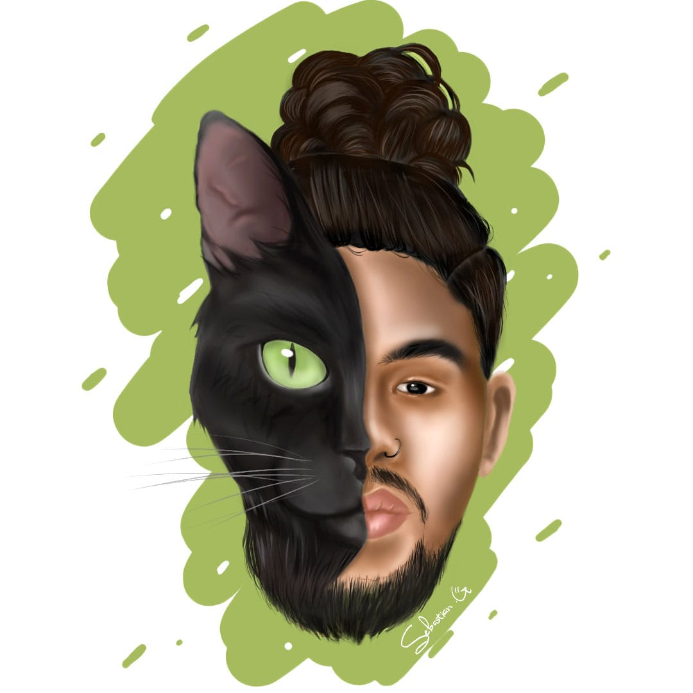

# programacion-de-videojuegos-grupo-213027_13
Proyecto de Programación de Videojuegos del Grupo 213027_13

Nombre: Andres Rocha Galeano
Rol: productor de audio, Desarrollo de Software e Innovación Tecnológica
Ubicación: Chía 
Perfil: Me gusta la tecnología enfocado en la creación de software. Mi enfoque es el desarrollo de aplicaciones moviles, diseño de interfaces y gestión de proyectos. 

Mi oficio actual es la producción de audio para audiovisuales y musica que he venido complementando con aplicativos multimedia. Como estudiante, busco constantemente integrar herramientas modernas que optimicen 
el flujo de trabajo y aporten valor real a los proyectos académicos y colectivos 
en los que participo.

## Daniel Andres Castro Silva

- **Rol en la industria**: Marketing, Creacion de Contenido
- **Ubicacion**: Bogota, Colombia
- **Perfil breve**: Actualmente soy editor de video, en una de las universidades virtuales más grandes del mundo, consiguiente soy estudiante de Ingieneria Multimedia. Me gusta la creacion de contenido, los videojuegos, las peliculas, la fotografia, y el gym.

## Nicolas Montaño Ortigoza
 

Soy Nicolas Montaño
Aun no tengo un rol en la industria sin embargo mi objetivo es enfocarme en toda la parte audiovisual
Vivo en la ciudad de Bogotá

## Angie Valentina Bastidas Martinez

- **Rol**: Animadora de videojuegos
-**Ubicación**: Colombia
-**Perfil**: Estudiante de Ingeniería Multimedia interesada en la animación digital y la creación de movimientos para personajes y escenarios dentro de videojuegos.
Me enfoco en aportar dinamismo, expresividad y realismo a las experiencias interactivas mediante animaciones 2D y 3D.Carpeta personal de Angie
Soy productor multimedia aunque actualmente trabajo en el campo del marketing y publicidad como trafficker en la implementación de campañas, mi objetivo es y se mantiene en adentrarme en el mundo de lo audiovisual poder vivir detrás de un lente y seguir evolucionando conforme a los retos que presenta este mundo
