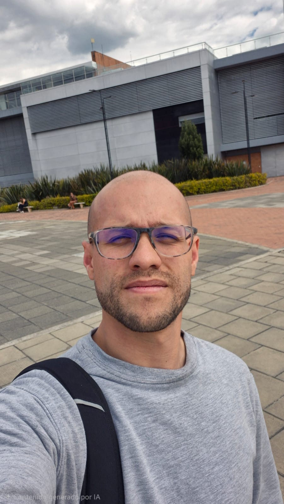
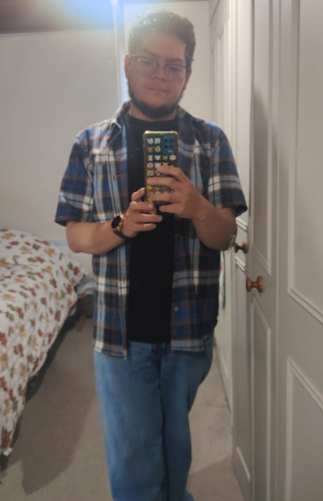

# programacion-de-videojuegos-grupo-213027_13
Proyecto de Programación de Videojuegos del Grupo 213027_13

Nombre: Andres Rocha Galeano
Rol: productor de audio, Desarrollo de Software e Innovación Tecnológica
Ubicación: Chía 
Perfil: Me gusta la tecnología enfocado en la creación de software. Mi enfoque es el desarrollo de aplicaciones moviles, diseño de interfaces y gestión de proyectos. 

Mi oficio actual es la producción de audio para audiovisuales y musica que he venido complementando con aplicativos multimedia. Como estudiante, busco constantemente integrar herramientas modernas que optimicen 
el flujo de trabajo y aporten valor real a los proyectos académicos y colectivos 
en los que participo.

# Luis Torres

## Rol en la industria
Diseñador de videojuegos / Game Designer

## Ubicación
Bogotá - Colombia

## Perfil
Soy diseñador y desarrollador en formación con interés en narrativa interactiva, diseño emocional y construcción de mundos. 
Me apasiona crear experiencias inmersivas que conecten con el jugador a nivel psicológico y simbólico. 
Actualmente trabajo en proyectos enfocados en mecánicas narrativas y estética artística inspirada en animación tradicional.